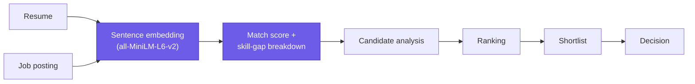
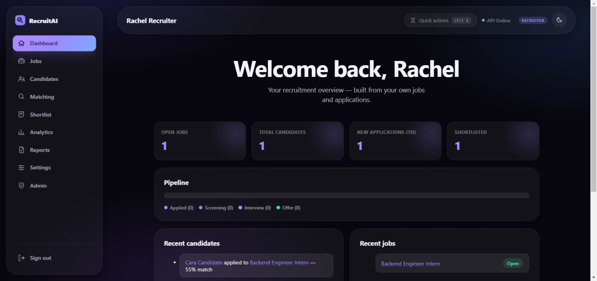
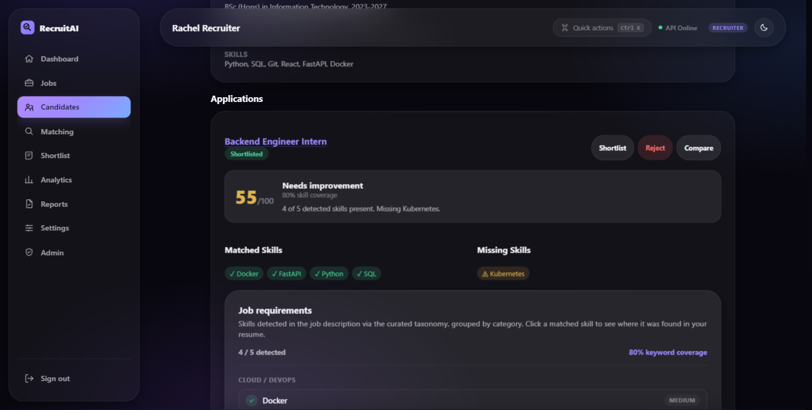
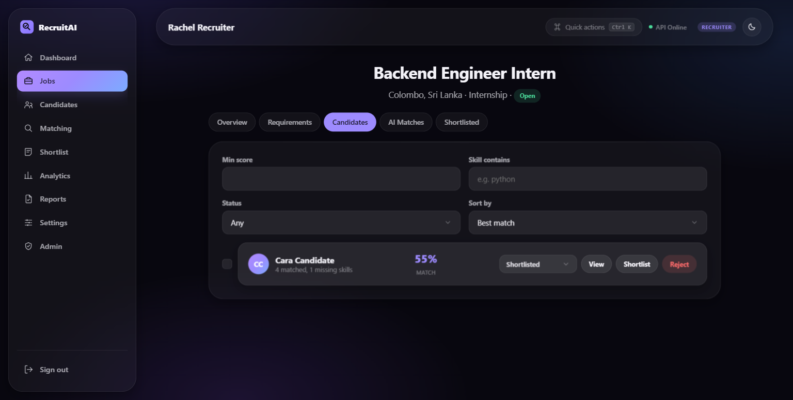
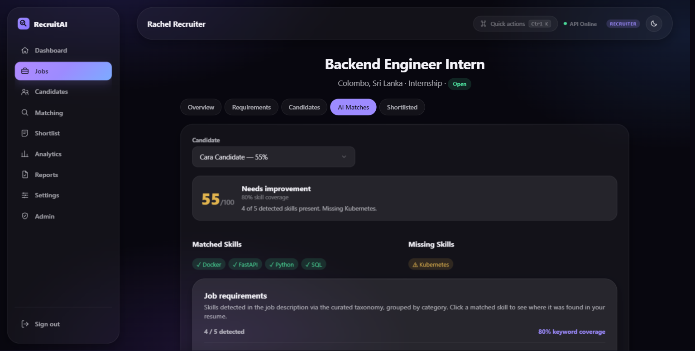

<p align="center"></p>

<p align="center">


</p>

# RecruitAI

A recruitment workspace for recruiters and candidates, built around one explainable NLP
matching pipeline — sentence-embedding semantic similarity plus curated skill-taxonomy
detection. Every match score, ranking, and analytics number in the app traces back to that
same pipeline; nothing is a black-box "AI score."

**Core flow:**



> **Note on the live demo:** the URL below is still running the project's earlier,
> single-role version (upload a CV, match it against a pasted job description). The
> RecruitAI rebuild described in this README — roles, job postings, the candidate
> pipeline, analytics — hasn't been deployed yet; run it locally (see below) to try it.
>
> **Previous live demo:** https://salmon-ground-0609b6e00.7.azurestaticapps.net
> (backend API: https://resume-match-api-stephan.azurewebsites.net)

## What it does

**Recruiters** post jobs, get candidates ranked by real match scores the moment they apply,
filter/sort/shortlist/reject, leave notes, compare candidates side by side, and see
analytics computed live from their own jobs and applications.

**Candidates** upload a resume (parsed once, reused everywhere), see how they match every
open role, apply, and track every application through a real status pipeline.

**Why semantic matching instead of keyword matching?** A keyword scanner rewards resumes
that happen to repeat the job description's exact phrasing and misses everything else.
Sentence embeddings compare *meaning*: a resume that says "led a team migrating services to
microservices" can match a job asking for "distributed systems experience" even with no
shared keyword. The skill taxonomy on top of that still gives recruiters an explicit,
checkable matched/missing skill list — so the score is semantic, but never a black box.

- **Role-based accounts** — recruiter or candidate, chosen at signup; the first account on
  a fresh database becomes an admin automatically.
- **Job management** — full CRUD (title, description, required/preferred skills,
  experience, education, location, employment type, status).
- **Resume management** — upload, parse, version, view, download, delete. Files are stored
  on disk (never a public URL) and only ever served to their owner or a recruiter with a
  legitimate application from that candidate.
- **AI matching** — sentence-transformer (`all-MiniLM-L6-v2`) cosine similarity for the
  overall score, plus a curated skill taxonomy for matched/missing skills, importance
  levels, category grouping, and evidence snippets pulled from the actual resume text. A
  job's structured required/preferred skill tags count toward matching too, not just the
  free-text description.
- **Candidate ranking** — filter by score/skill/status, sort by best match/newest/skills
  matched.
- **Shortlist pipeline** — Applied → Screening → Interview → Offer, plus one-click
  Shortlist/Reject, each transition timestamped in an audit trail.
- **Compare candidates** — side-by-side table for any set of applicants to one job.
- **Analytics** — pipeline funnel, match-score distribution, skills demand — all real
  aggregates over the recruiter's own data, recomputed on every request.
- **Reports** — CSV and PDF exports for a job's candidates or the full shortlist.
- **Command palette** (`Ctrl`/`Cmd` + `K`) — role-aware quick actions (create a job,
  search candidates, open the shortlist, jump to settings, etc.).
- **Liquid Glass design system** — a small component library (`GlassCard`, `GlassButton`,
  `GlassInput`, `GlassSelect`, `GlassCheckbox`, `GlassBadge`, `GlassMetric`, `GlassTable`,
  `GlassCandidateCard`, `GlassModal`, `GlassToast`, `GlassSkeleton`, `GlassEmptyState`,
  `GlassSidebar`, `GlassNavbar`) built on centralized CSS variables, with light/dark themes.

### What's deliberately not there

- **"Continue with Google"** isn't rendered on login/signup — no OAuth client is
  configured on the backend, so a Google button would be a non-functional prop, not a
  real feature.
- **Password reset emails** aren't sent — no email service is configured. Forgot-password
  issues a real, working reset token and hands it back directly in the UI, clearly labeled
  as demo mode, rather than falsely claiming an email went out.
- **The Muse live-internship integration** from the project's earlier version (see
  `backend/job_source_*.py`) is left in the repo but unwired — jobs are now created by
  recruiters, not pulled from an external feed.

## Architecture

- **`backend/`** — FastAPI service.
  - JWT auth (PBKDF2-HMAC-SHA256 password hashing) with recruiter/candidate roles and an
    orthogonal admin flag.
  - The matching pipeline lives in `resume_analyzer.py` (PDF extraction, embeddings,
    taxonomy skill detection) and `job_matcher.py` (applies it to one job or many at
    once) — one engine, shared by every route that needs a score.
  - SQLite via SQLAlchemy (`Job`, `Resume`, `Application`, `ApplicationEvent`, `Note`,
    `User`, `PasswordResetToken`) — swap `DATABASE_URL` for a real Postgres URL in
    production without touching the models.
  - Resume files on disk under `RESUME_STORAGE_DIR`, access-controlled per request.
- **`frontend/`** — React (Vite) + `react-router-dom`, role-gated route trees for
  recruiters and candidates, styled entirely through the Liquid Glass component library
  and a centralized CSS-variable palette (`frontend/src/index.css`,
  `frontend/src/styles/glass.css`).

## Running it locally

**Backend:**
```
cd backend
pip install -r requirements.txt
uvicorn main:app --reload
```

**Frontend:**
```
cd frontend
npm install
npm run dev
```

The frontend expects the API at `VITE_API_URL` (see `frontend/.env`, default
`http://localhost:8000`). The backend allows extra CORS origins via the comma-separated
`ALLOWED_ORIGINS` env var if your dev server picks a different port.

## Testing

**Backend** — pytest, against an isolated temp SQLite database and resume-storage
directory (never your dev data): signup/roles/admin bootstrap, job CRUD and ownership
scoping, resume upload/parsing/versioning/access-control, the full apply → rank → status →
shortlist → notes → compare pipeline, analytics aggregates, CSV reports, and admin
oversight/cascading deletes.
```
cd backend
pip install -r requirements-dev.txt
pytest
```

**Frontend** — Vitest + React Testing Library: matching-adjacent utilities (score bands,
skill labels), the API fetch wrapper's error handling, route guards (auth/role/admin
redirects), core Glass components, and the login form's validation/submit flow.
```
cd frontend
npm test
```

**Production build:**
```
cd frontend
npm run build
```

## What this demonstrates

- A real explainable-AI pipeline (sentence embeddings + a transparent skill taxonomy)
  applied consistently across an entire product surface — matching, ranking, analytics —
  rather than as a single demo endpoint.
- A two-sided, role-based product (not just a CRUD app): recruiters and candidates see
  different data, different navigation, and different permissions enforced server-side.
- A small, real design system (Liquid Glass) built from centralized tokens, not a UI
  library, with its own component API.
- Backend and frontend test suites that exercise permission boundaries and real computed
  values, not just happy-path rendering.

## Screenshots

**Recruiter dashboard**


**Candidate detail — AI match breakdown, resume sections, notes**


**Candidate ranking for a job**


**AI Matches — per-candidate score breakdown**

